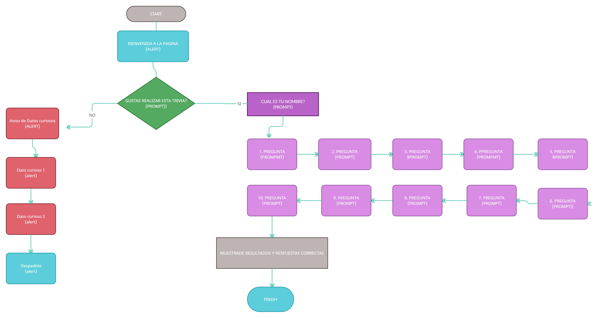

# **Proyecto 1**

## **Trivia Turismo en México**

**Preámbulo:** Es un día como cualquiera dentro de la facultad de turismo en el Universidad Vercruzana, los alumnos de quinto semestre están debatiendo sobre quien tiene más conociemiento sobre los lugares turísticos en México. Entonces llegan a unn acuerdo sobre pedirle a su maestro Francisco que realice una lista de preguntas para que ellos la resuelvan y ver quien tiene mayor cantidad de respuestas correctas y por ende es quien tiene el conocimeinto más amplio. Pero tienen que idear un plan para que no sienta tan aburrido como un examen y que funcione de una forma más rápida y eficiente para que nadie pueda copiarse y que el maestro Francisco no tenga que revisar uno por uno.

**Problema:** Necesitamos una Trivia!

**Solución:** Necesitamos crear un proyecto web con preguntas y respuestas, nos debe permitir ingresar su nombre y sus respuestas, también necesitamos que muestre el conteo de respuestas correctas e incorrectas, para lograr esta amistosa competencia por la mejor puntuación.

------------------
## **Diagrama de Flujo**

